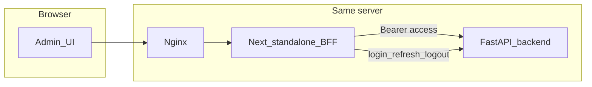

# План: админ-панель «По Рублю»

## Контекст

- В [porublyuadmin](.) сейчас **только** [docs/](docs/) — приложения нет; разработка — **greenfield**.
- Источник API для админки: [docs/api_admin.md](docs/api_admin.md) (base `**/api/v1/admin**`, суммы в копейках, cursor-пагинация, ошибки как в публичном API). Публичный [docs/api_client_guide.md](docs/api_client_guide.md) — для общих правил форматов; эндпоинты админки брать из `api_admin.md`.
- UI/UX, экраны, компоненты — [docs/porubly_admin_frontend_tz.md](docs/porubly_admin_frontend_tz.md).
- Стиль кода/стек — уточнить с [docs/rules/FRONTEND_RULES.md](docs/rules/FRONTEND_RULES.md): **Next.js 15, React 19, Tailwind v4**, TanStack Query, Zustand, RHF+Zod, Axios, FSD-ориентированная структура фич (совместимо с маршрутами из ТЗ).
- **Деплой:** в [docs/rules/DEPLOY_RULES.md](docs/rules/DEPLOY_RULES.md) указана статическая папка `admin-dist`. Для соблюдения [ТЗ §16](docs/porubly_admin_frontend_tz.md) (httpOnly `refresh_token` через Next API Routes) выбран вариант **Next.js `output: 'standalone'**` в Docker + **nginx `proxy_pass**` на контейнер админки (тот же сервер, что и бекенд). Статическая раздача из `root /var/www/admin` для этой схемы **не** используется; при необходимости позже можно дописать отдельный фрагмент в DEPLOY_RULES под `admin`-сервис.

## Архитектура клиента

1. `**NEXT_PUBLIC_API_URL**` — полный URL до админского API, например `https://backend.porublyu.parmenid.tech/api/v1/admin` (Axios: пути вида `/auth/login`, `/foundations`, …).
2. **BFF (`app/api/...`)** — логин: прокси на `POST /auth/login`, выставить **httpOnly** cookie с `refresh_token` (и при logout — очистка). Refresh: читать cookie, вызывать `POST /auth/refresh`, вернуть новый `access_token` в JSON, обновить cookie при ротации refresh.
3. **Zustand** — `access_token` + данные `admin` **только в памяти**; после F5 — вызов BFF refresh, затем заполнение store (как в ТЗ §16.4).
4. **Axios** — interceptor: подставлять `Authorization`; на 401 — один раз refresh через BFF, повтор запроса; при провале — logout и редирект на `/login`.
5. **CORS** — бекенд должен разрешить origin админки для запросов с заголовком `Authorization` (если админка и API на разных хостах). Проверить на стенде сразу после первого логина.

## Фазы работ

### 1. Инициализация проекта

- В корне репозитория (рядом с [docs/](docs/)): `create-next-app` с App Router, TypeScript strict, ESLint, Tailwind **v4** по [FRONTEND_RULES](docs/rules/FRONTEND_RULES.md).
- Зависимости: `@tanstack/react-query`, `@tanstack/react-table`, `zustand`, `axios`, `react-hook-form`, `zod`, `@hookform/resolvers`, `lucide-react`, `sonner`, `recharts`, `date-fns`, `clsx`, `tailwind-merge`.
- Env: `.env.example` с `NEXT_PUBLIC_API_URL`, настройками cookie (имя, `secure`, `sameSite`).

### 2. Дизайн-токены и UI-kit ([ТЗ §1, §14](docs/porubly_admin_frontend_tz.md))

- Глобальные CSS variables (палитра, радиусы), шрифты **Inter** + **Geist Mono** (next/font / CSS).
- Базовые компоненты в `src/shared/ui` или `src/components/ui`: `Button`, `Input`, `Textarea`, `Select`, `Checkbox`, `Badge`, `Skeleton`, `Dialog`/`Modal`, `DropdownMenu`, `ConfirmDialog`, `DataTable` (обёртка над TanStack Table), `EmptyState`, `StatCard`, `PageHeader`/breadcrumbs hooks.
- `formatKopecks`, `rublesToKopecks`, `formatDateTime` — общие утилиты ([ТЗ §14.9–14.10](docs/porubly_admin_frontend_tz.md)).

### 3. Каркас приложения

- Группа `(auth)/login` — страница входа, форма + Sonner/inline ошибки (`ADMIN_AUTH_FAILED` → как `INVALID_CREDENTIALS` в таблице ТЗ).
- Группа `(admin)/layout` — Sidebar (240px), Topbar, провайдер QueryClient, обёртка для защищённых маршрутов (клиент: нет access после гидрации — дернуть BFF refresh, иначе `/login`).
- Навигация — как в [ТЗ §3](docs/porubly_admin_frontend_tz.md); активное состояние для вложенных маршрутов (например `/campaigns/[id]`).

### 4. API-слой

- Типы ответов/запросов по [docs/api_admin.md](docs/api_admin.md) (можно начать с ручных интерфейсов, критичные DTO — строго по доку).
- Модуль `lib/api/adminClient.ts` (Axios instance на `NEXT_PUBLIC_API_URL`).
- Ошибки: парсинг `error.code` из тела + fallback на `detail` FastAPI ([api_client_guide](docs/api_client_guide.md)).
- Пагинация: универсальный хелпер для `cursor` + кнопка «Загрузить ещё».

**Замечание по путям в ТЗ:** в приложении A маршруты вида `/logs/allocation`, а HTTP к бекенду — `**GET /allocation-logs**` и `**GET /notification-logs**` (см. [api_admin.md](docs/api_admin.md)), не `/logs/allocation-logs`.

### 5. Экраны (порядок внедрения)

| Приоритет | Маршрут                                   | Ключевые API                                                                                   |
| --------- | ----------------------------------------- | ---------------------------------------------------------------------------------------------- |
| 1         | `/`                                       | `GET /stats/overview` + фильтр периода, Recharts при необходимости                             |
| 2         | `/foundations`, `/foundations/[id]`       | list/create/PATCH, модалка создания, медиа                                                     |
| 3         | `/campaigns`, `/campaigns/[id]`           | CRUD, переходы статусов, документы, благодарности, офлайн-платежи, `GET /stats/campaigns/{id}` |
| 4         | `/users`, `/users/[id]`                   | список/деталь, patron, activate/deactivate                                                     |
| 5         | `/payouts`                                | list, balance, create                                                                          |
| 6         | `/achievements`                           | list, create, PATCH                                                                            |
| 7         | `/logs/allocation`, `/logs/notifications` | cursor-таблицы                                                                                 |
| 8         | `/admins`, `/admins/[id]`                 | CRUD админов, deactivate/activate                                                              |

Везде: состояния загрузки/пусто/ошибка ([ТЗ §15](docs/porubly_admin_frontend_tz.md)), подтверждения для деструктивных действий.

### 6. Медиа

- Компонент загрузки: `POST /media/upload` (multipart), затем подстановка URL в формы фонда/кампании ([ТЗ §13](docs/porubly_admin_frontend_tz.md)).

### 7. Проверка и прод

- Локально: `npm run dev`, сценарии — логин, refresh после истечения access (по возможности укоротить TTL только на стенде), основные CRUD на одной сущности каждого типа.
- **Dockerfile** для Next standalone; пример **docker-compose** фрагмента: сервис `admin`, порт 3000, `NEXT_PUBLIC_API_URL` на ваш API.
- **Nginx:** `server_name` админки → `proxy_pass http://admin:3000` (и заголовки `X-Forwarded-*`), без `try_files` статики.
- Чек-лист: health контейнера, переменные окружения, что cookie `Secure` включён на HTTPS.

## Риски и учёт

- Несовпадение кодов ошибок ТЗ (`INVALID_CREDENTIALS`) и API (`ADMIN_AUTH_FAILED`) — маппить оба на одно UX-сообщение.
- [FRONTEND_RULES](docs/rules/FRONTEND_RULES.md) (Next 15 / Tailwind 4) vs ТЗ (Next 14) — при реализации следовать **FRONTEND_RULES** как правилам репозитория.

## Итог

После выполнения: рабочая админка с UI-китом, всеми разделами ТЗ, связью с реальным бекендом, Docker-образом и nginx-прокси для выката на том же сервере, что и API.