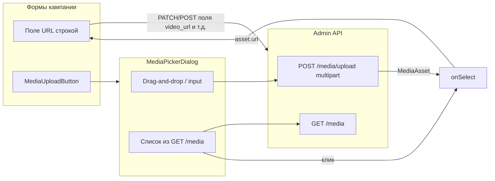

# Анализ медиа-логики и план (porublyuadmin vs описанный паттерн)

## Важное уточнение

Ваш раздел с `CategoryForm`, `mediaApi.getUploadUrl` / `register`, `getFileContentUrl` и `FileAsset` **не относится к этому репозиторию** — таких путей в [porublyuadmin](.) нет. Здесь другой API-контракт ([docs/api_admin.md](docs/api_admin.md) §4.1): **один запрос** `POST /admin/media/upload` с `multipart/form-data`, плюс листинг медиа. На проде в OpenAPI есть, среди прочего: `GET /api/v1/admin/media`, `POST .../media/upload`, `GET/DELETE .../media/{media_id}`.

Имеет смысл воспринимать ваш текст как **эталонный паттерн для переноса в другой проект**, а ниже — как **фактическое устройство Porublyu Admin** и что менять, если хотите сблизить UX или архитектуру.

---

## Как устроено в Porublyu Admin (факт)

| Ваш концепт                               | В этом репозитории                                                                                                                                |
| ----------------------------------------- | ------------------------------------------------------------------------------------------------------------------------------------------------- |
| `FileAsset` + `cdn_url` / `file_url`      | `[MediaAsset](src/lib/api/types.ts)`: `id`, `key`, `url`, `filename`, `size_bytes`, `content_type`, опционально `type`                            |
| Канонический URL для сохранения           | Прямо `**asset.url**` из ответа upload или из списка; отдельного `getFileContentUrl` нет                                                          |
| Presigned → PUT S3 → register             | **Нет**: один шаг — `[FormData` + `POST /media/upload](src/components/media/media-picker-dialog.tsx)` (`file` + `type`: `video`                   |
| Список медиа                              | `[GET /media](src/components/media/media-picker-dialog.tsx)` с `limit: 100`, **без курсора в UI**; фильтр только **поиск по имени** на клиенте    |
| React Query: `useUploadFile` + invalidate | Загрузка **внутри диалога** через `useQuery` + локальный `uploading`; после успеха `**refetch()**` списка, не общий `mutation` + `invalidateKeys` |
| Две вкладки «Медиатека» / «Загрузить»     | **Одна колонка**: сверху зона загрузки, ниже поиск и список (не табы)                                                                             |
| `closeOnOverlayClick={false}`             | Наоборот: `[Dialog](src/components/ui/dialog.tsx)` закрывается по клику на **backdrop** (`e.target === ref.current`)                              |
| Отдельная страница «Медиатека»            | **Нет** отдельного экрана; только модалка                                                                                                         |
| `ImageUpload` как второй путь             | Отдельного универсального компонента нет; только `[MediaUploadButton](src/components/media/media-upload-button.tsx)` + ручной `Input` для URL     |

**Где используется:** `[MediaUploadButton](src/components/media/media-upload-button.tsx)` подключён в [карточке кампании](src/app/(admin)/campaigns/[id]/page.tsx) (документы PDF, thanks video/audio) и в [создании кампании](src/app/(admin)/campaigns/page.tsx) (видео/превью по смыслу ТЗ). Паттерн тот же, что вы описали для форм: **в API уходит строка URL**, файл в PATCH не вложен.

---

## Наблюдения и риски

1. **Тип файла в библиотеке:** при открытии диалога для `uploadType: "video"` список всё равно грузится как **все** записи `GET /media` и **не фильтруется** по `content_type` / `type` — пользователь теоретически может выбрать PDF в сценарии «видео». Имеет смысл либо фильтровать на клиенте, либо договорить query-параметры с бэкендом.
2. **Масштаб библиотеки:** жёсткий `limit: 100` без пагинации в UI — при росте каталога поведение ухудшится (ваш тезис про поиск/папки релевантен).
3. **Загрузка:** один спиннер на всю зону, **нет очереди** и прогресса по файлу (совпадает с пунктом в [.cursor/plans/tz_vs_admin_gaps_5219f5ec.plan.md](.cursor/plans/tz_vs_admin_gaps_5219f5ec.plan.md) про MediaUploader).
4. **Закрытие по оверлею:** для «сложных форм с вложенными модалками» текущее поведение **менее безопасно**, чем в вашем эталоне — возможны случайные закрытия.

---

## План действий (на выбор цели)

### A. Документация и перенос в другой проект

- Зафиксировать для команды **два варианта контракта**: (1) multipart через бэкенд, как здесь; (2) presigned + регистрация, как в вашем тексте — и не смешивать их в одном клиенте без явной ветки.
- При портировании **UI-паттерна** из вашего описания в проект с **текущим** Porubly API: оставить модалку «список + загрузка», но реализовать `upload` как `FormData` → `/media/upload`, `onSelect` → `asset.url` в поле формы.

### B. Сблизить UX с вашим описанием (без смены бэкенда)

- Разнести UI на **две вкладки** («Библиотека» / «Загрузить») или явные секции с тем же API.
- Опция **не закрывать по клику на backdrop** для медиа-диалога (отдельный проп или вариант `Dialog`).
- **Фильтр списка** по типу медиа + **пагинация** (`cursor` из API, если бэкенд отдаёт `pagination`).
- Очередь загрузки, **прогресс**, клиентская **валидация размера/MIME** до отправки (ТЗ §13).

### C. Сменить архитектуру на presigned + регистрация (как в вашем тексте)

- Требует **нового или дополнительного** контракта на бэкенде (эндпоинты presigned, register, модель `FileAsset`).
- После этого — вынести цепочку в `mediaApi` + `useMutation`, унифицировать `onSelect` с `getFileContentUrl`-аналогом.

---

## Рекомендуемый порядок, если улучшать именно этот репозиторий

1. Исправить **фильтрацию списка** по типу (и при необходимости — query на бэкенде).
2. Добавить **пагинацию** для `GET /media` и улучшить поиск (при поддержке API).
3. Доработать **загрузку**: валидация, опциональная очередь, прогресс (п. B).
4. По продуктовой необходимости — **отключить закрытие по оверлею** для этого диалога.
5. Переход к варианту C только после согласования с бэкендом.

